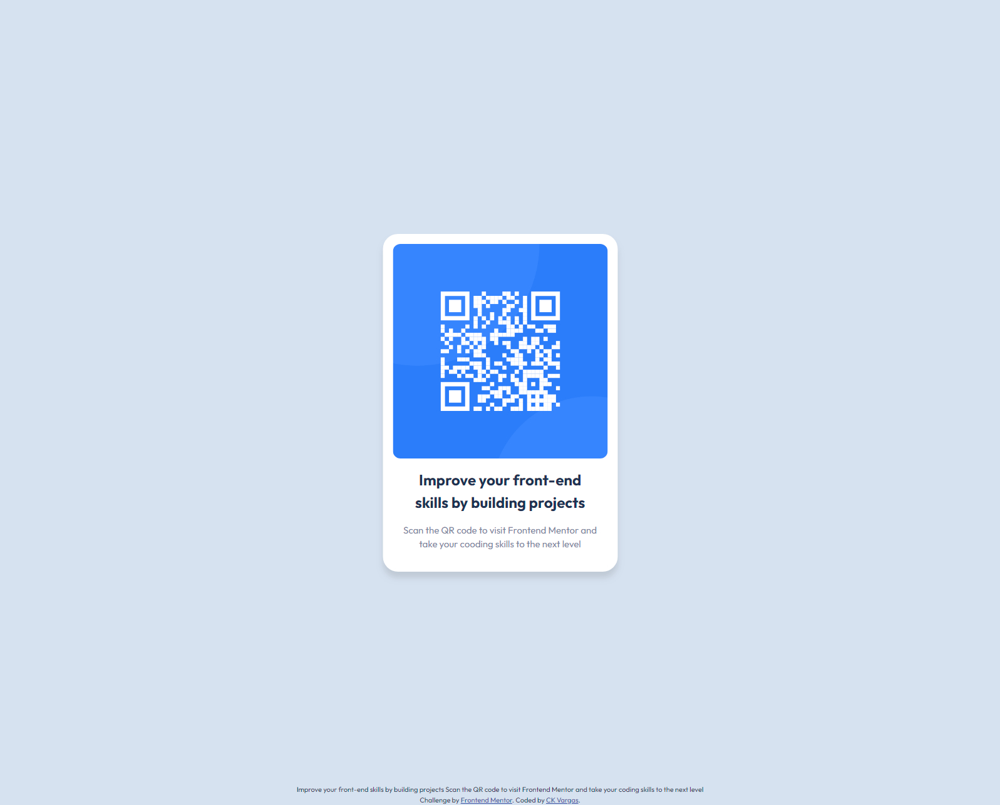

# Frontend Mentor - QR code component solution

This is a solution to the [QR code component challenge on Frontend Mentor](https://www.frontendmentor.io/challenges/qr-code-component-iux_sIO_H). Frontend Mentor challenges help you improve your coding skills by building realistic projects.

## Table of contents

- [Overview](#overview)
  - [Screenshot](#screenshot)
  - [Links](#links)
- [My process](#my-process)
  - [Built with](#built-with)
  - [What I learned](#what-i-learned)
  - [Useful resources](#useful-resources)
- [Author](#author)

## Overview

### Screenshot



### Links

- Solution URL: [GitHub](https://github.com/CKVargas/qr-code-component-challenge)
- Live Site URL: [Netlify](https://ck-vargas-qr-code-challenge.netlify.app/)

## My process

### Built with

- Semantic HTML5 markup
- CSS custom properties
- Flexbox

### What I learned

```css - This centered my footer
.footer {
	position: fixed;
	left: 0;
	bottom: 0;
	width: 100%;
	text-align: center;
}
```

### Useful resources

- [Box Shadow CSS Generator](https://cssgenerator.org/box-shadow-css-generator.html) - This helped me for visualize the box-shadow easily.

- [W3Schools](https://www.w3schools.com/howto/howto_css_fixed_footer.asp) - I learned how to create a fixed footer with this.

- [CSS Reset](https://www.joshwcomeau.com/css/custom-css-reset/) - This is my first time using this and I'm loving it!

## Author

- GitHub - [CK Vargas](https://github.com/CKVargas)
- Frontend Mentor - [@CKVargas](https://www.frontendmentor.io/profile/CKVargas)
